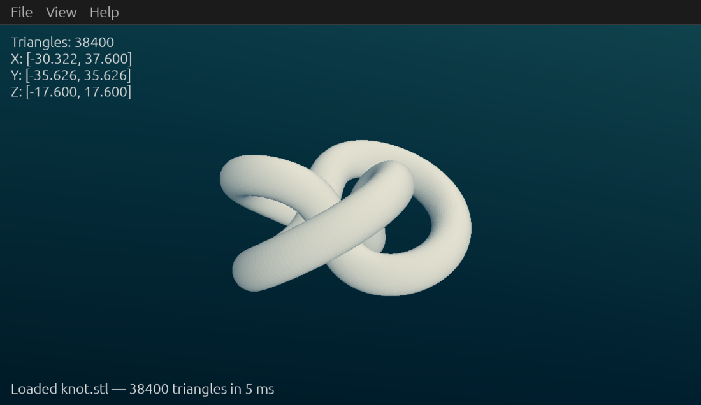
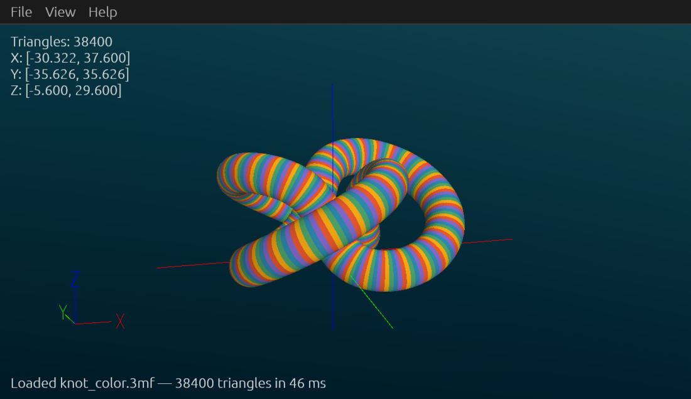
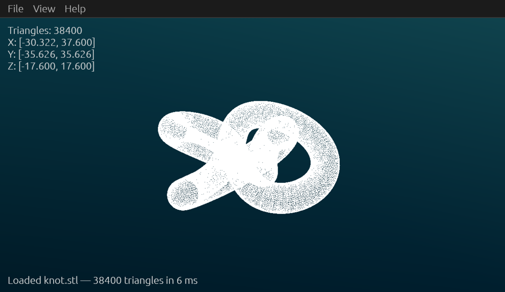
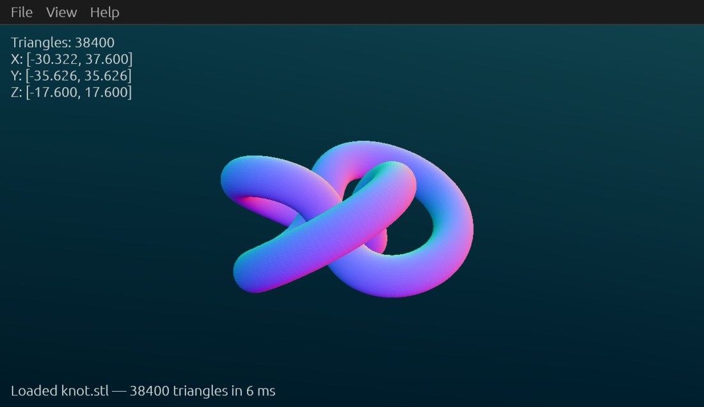
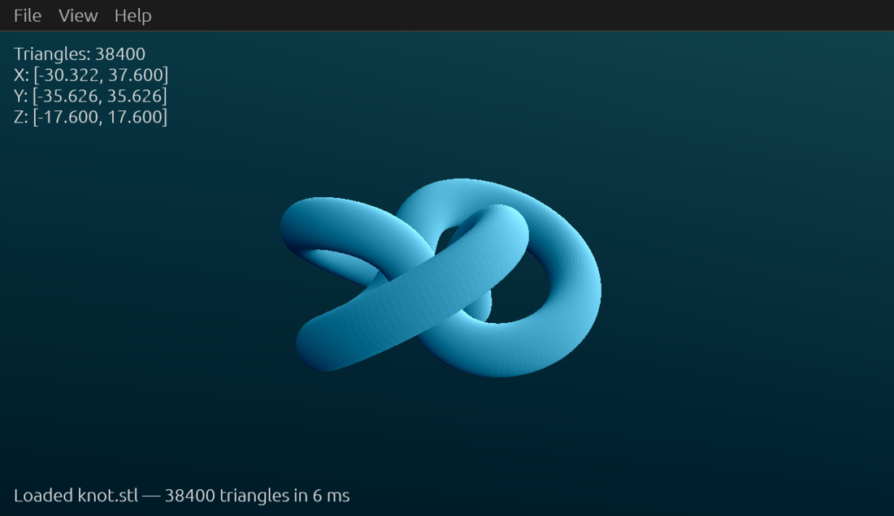

# view3d

A very fast viewer for **STL**, **3MF** and **OBJ** models, written in Rust.

It is a re-implementation of [fstl](https://github.com/fstl-app/fstl) — the same
feature set, camera feel and shading — with two additions: it reads 3MF
(including the slicer project files that split objects across model parts) and
OBJ, and it renders the colors those formats carry.

Rendering is [wgpu](https://wgpu.rs); the menus, dialogs and overlays are
[egui](https://github.com/emilk/egui).



[](https://github.com/adamrpostjr/view3d/actions/workflows/ci.yml)
[](LICENSE)

## Why

Opening a mesh should be instant, even when the mesh is enormous. view3d loads
a **2 million triangle** binary STL in about **170 ms** and then holds a
smooth frame rate while you spin it: files are memory-mapped, parsed in
parallel, and welded with a parallel sort. There is no scene graph, no import
wizard, and no splash screen — you double-click a file and it is on screen.

## Draw modes

| Shaded | Material Color |
| --- | --- |
|  |  |
| The default fstl look: a flat-shaded surface with the normal recovered per-fragment. | 3MF color groups and base materials, or OBJ/MTL diffuse colors. Axes shown here too. |

| Wireframe | Surface Angle |
| --- | --- |
|  |  |
| Every edge, deduplicated into a line list. | Face orientation mapped to color — handy for spotting overhangs. |

| Mesh Light | |
| --- | --- |
|  | Configurable ambient and directional light, with 26 light directions to choose from. |

## Installing

### Arch Linux

Build and install a real pacman package from this checkout:

```sh
packaging/arch/install.sh        # runs makepkg --syncdeps --install
```

Uninstall with `sudo pacman -R view3d`.
[`packaging/arch/PKGBUILD.aur`](packaging/arch/PKGBUILD.aur) is the `view3d-git`
template for publishing to the AUR.

### Anywhere else

```sh
cargo build --release
xdg/install.sh                   # installs to ~/.local, or set PREFIX=/usr/local
```

Both routes install the binary, icons and desktop entry, and register the
`model/3mf` MIME type. `xdg/install.sh` also claims the default handler for
`.stl`, `.3mf` and `.obj`; after installing the pacman package, do that
yourself if you want it:

```sh
xdg-mime default view3d.desktop model/stl model/3mf model/obj
```

Building requires Rust 1.95 or newer.

## Using it

```sh
view3d model.stl                 # or drop a file on the window
```

| Action | Input |
| --- | --- |
| Rotate | Left-drag |
| Pan | Right-drag |
| Zoom about cursor | Scroll wheel |
| Open a file | `Ctrl+O`, or drop one on the window |
| Open in another app | `Alt+S` |
| Reload | `F5` |
| Previous / next file in folder | `←` / `→` |
| Viewpoints | `0` iso, `1` top, `2` bottom, `3` front, `4` back, `5` left, `6` right, `9` recenter |
| Fullscreen | `F11` |
| Hide menu bar | `Ctrl+Shift+C` |
| Quit | `Ctrl+Q` |

Projection switches between perspective and orthographic, and every view
setting persists between runs. **Autoreload** watches the open file and reloads
it when it changes on disk, which makes view3d a live preview to sit beside a
CAD tool or slicer.

Rendering a model straight to a PNG, for thumbnails or docs:

```sh
view3d model.3mf --screenshot render.png
```

## Format notes

- **STL** — binary files are memory-mapped and parsed in parallel. Binary
  versus ASCII is decided by size arithmetic rather than the misleading `solid`
  prefix. Magics-style per-facet colors are read when present.
- **3MF** — build items, component trees and unit scaling are all honoured, and
  objects split across model parts by the production extension (`p:path`) —
  what Bambu Studio, Orca and PrusaSlicer write — are followed. Colors come
  from base materials and the materials extension's color groups.
- **OBJ** — polygons are triangulated and MTL diffuse colors applied. OBJ is
  conventionally Y-up, so files are rotated to Z-up on import; the View menu
  can turn that off.

Slicer project files often store their paint colors in vendor-specific metadata
rather than standard 3MF color groups. Those models load fine but render in the
neutral fallback color in Material Color mode.

## Linux backend note

winit implements file drag-and-drop on X11, Windows and macOS, but not on
Wayland — under a native Wayland surface the drop events never arrive. view3d
therefore asks for the X11 backend by default on Linux (through XWayland in a
Wayland session) so that dropping a file on the window works. Set
`VIEW3D_BACKEND=wayland` for a native Wayland window, accepting that drops will
not work there; `VIEW3D_BACKEND=x11` forces X11.

## Development

```sh
cargo test                       # loader tests
cargo clippy --all-targets
cargo run --release --example meshinfo -- model.3mf    # headless file check
```

`meshinfo` prints triangle and vertex counts, the bounding box, load time and
whether the file carried colors — useful for checking a pile of files at once:

```sh
find ~/models -iname '*.3mf' -print0 | xargs -0 ./target/release/examples/meshinfo
```

The loader tests generate a cube in each format at test time — including a 3MF
that exercises units, a build transform, a component reference and a color
group — and assert that all three describe the same box.

The screenshots above are reproducible:

```sh
python3 docs/make-models.py /tmp/view3d-models
python3 docs/make-screenshots.py /tmp/view3d-models docs/screenshots
```

## Layout

| Path | What lives there |
| --- | --- |
| `src/loader/` | STL, 3MF and OBJ readers, all producing one `Mesh` |
| `src/render/` | wgpu pipelines and the WGSL shaders |
| `src/camera.rs` | Arcball, pan, zoom and the viewpoint presets |
| `src/app.rs` | Menus, shortcuts, file watching and overlays |
| `xdg/`, `packaging/` | Desktop integration and the Arch package |

## License and credit

MIT — see [LICENSE](LICENSE).

view3d exists because [fstl](https://github.com/fstl-app/fstl) by **Matthew
Keeter** got the important things right, and parts of it are direct
translations of his work rather than merely inspired by it: the fragment
shaders, the camera and viewpoint math, and the axis geometry all come from
fstl's source, which is MIT licensed, © 2014-2017 Matthew Keeter. Those
portions remain under that license; see [LICENSE](LICENSE) for the specifics.
